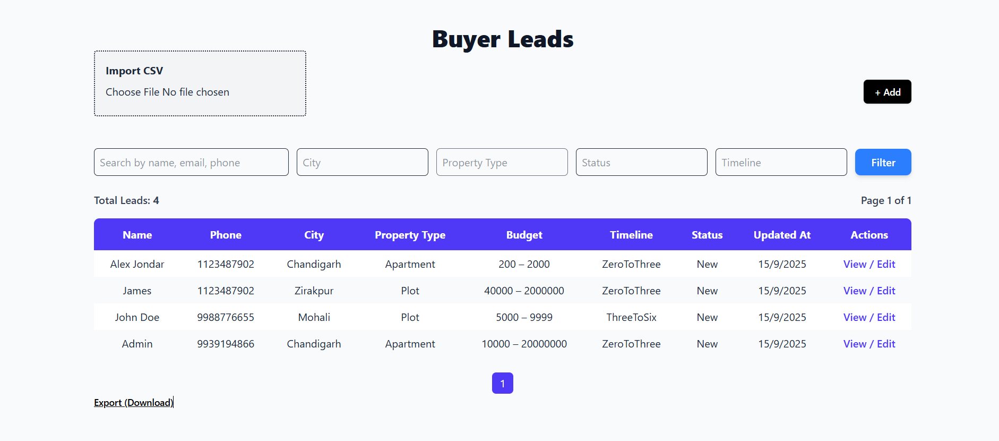

# Mini Buyer Lead Intake App

**Goal:** Build a small app to ** manage buyer leads** with validation, search/filter, and CSV import/export.

---

## Stack

- Next.js (App Router) + TypeScript  
- Database: Postgres/Supabase/SQLite with Prisma + migrations  
- Zod for validation  
- Auth: simple magic link or demo login  
- Git with meaningful commits  

---

## Data Model

### buyers (leads)

| Field | Type | Notes |
|-------|------|------|
| id | uuid | Primary key |
| fullName | string | 2–80 chars |
| email | string | optional |
| phone | string | 10–15 digits, required |
| city | enum | `Chandigarh|Mohali|Zirakpur|Panchkula|Other` |
| propertyType | enum | `Apartment|Villa|Plot|Office|Retail` |
| bhk | enum | `Studio|1|2|3|4`, optional for non-residential |
| purpose | enum | `Buy|Rent` |
| budgetMin | int | INR, optional |
| budgetMax | int | INR, optional, ≥ budgetMin |
| timeline | enum | `0-3m|3-6m|>6m|Exploring` |
| source | enum | `Website|Referral|Walk-in|Call|Other` |
| status | enum | `New|Qualified|Contacted|Visited|Negotiation|Converted|Dropped`, default `New` |
| notes | text | optional, ≤ 1,000 chars |
| tags | string[] | optional |
| ownerId | string | user id |
| updatedAt | timestamp | last updated |

### buyer_history

| Field | Type | Notes |
|-------|------|------|
| id | uuid | Primary key |
| buyerId | uuid | FK to buyers |
| changedBy | string | user id |
| changedAt | timestamp | change timestamp |
| diff | JSON | changed fields |

---

## Pages & Flows

### 1) Create Lead – `/buyers/new`

**Fields:**  
`fullName, email, phone, city, propertyType, bhk (conditional), purpose, budgetMin, budgetMax, timeline, source, notes, tags[]`

**Validation:**  
- `fullName` ≥ 2 chars  
- `phone` 10–15 digits  
- `email` valid if provided  
- `budgetMax ≥ budgetMin`  
- `bhk` required for Apartment/Villa  

**On submit:**  
- Create buyer  
- Assign `ownerId`  
- Log change in `buyer_history`  

### 2) List & Search – `/buyers`

- SSR with real pagination (10 rows/page)  
- Filters: `city, propertyType, status, timeline`  
- Debounced search: `fullName, phone, email`  
- Sort by `updatedAt` desc  
- Columns: Name, Phone, City, PropertyType, Budget, Timeline, Status, UpdatedAt  
- Row actions: View / Edit  

### 3) View & Edit – `/buyers/[id]`

- Show all fields  
- Edit with validation rules  
- Concurrency check with `updatedAt`  
- Show last 5 history changes  

### 4) Import / Export

- CSV Import (max 200 rows)  
  - Validate per row  
  - Transaction insert for valid rows  
- CSV Export of filtered list  

---

## Ownership & Auth

- Logged-in users can **read all buyers**  
- Only **owners** can edit/delete their buyers  
- Optional admin role for full access  

---

## Quality Bar

- 1 unit test (CSV/budget validator)  
- Rate-limit create/update per user/IP  
- Error boundary + empty state  
- Accessibility: labels, keyboard focus, ARIA error messages  

---

## Setup

1. Install dependencies:  
```bash
npm install
```

## Create .env:
```

NEXT_PUBLIC_SUPABASE_URL=" your supabase url"
NEXT_PUBLIC_SUPABASE_ANON_KEY= "your_key  " 


# Connect to Supabase via connection pooling
DATABASE_URL="your_database_url"

# Direct connection to the database. Used for migrations
DIRECT_URL=" your_direct_link"

```

Run migrations & seed:
```
npx prisma migrate dev --name init
npx prisma generate

```

Run locally:
```
npm run dev
```

## Design Notes

Validation: src/lib/validation.ts (Zod, client + server)

SSR vs Client:

/buyers uses SSR

Forms are client-side, server-validated

Accessibility: labels, keyboard focus, error announcements

## DONE AND SKIPPED

| Feature                      | Status    | Notes                             |
| ---------------------------- | --------- | --------------------------------- |
| CRUD                         |  Done    | Full create, view, edit, delete   |
| CSV Import/Export            |  Done    | Transaction-safe, filtered export |
| Filters & Search             |  Done    | Debounced, URL-synced             |
| Ownership Enforcement        |  Not Done   |   Ongoing               |
| Rate-limits                  | Not Done    | Ongoing                |
| Unit Tests                   |  Done    | Buyer schema example              |
| Error Boundary / Empty State |  Not Done    | Unkonw                          |
| Accessibility                |  Done    | Labels, focus, ARIA               |
| Admin Role                   | Skipped | Optional                          |
| File Upload                  |  Skipped | Optional                          |

#sample image

